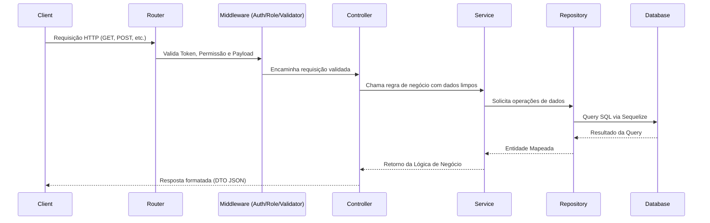
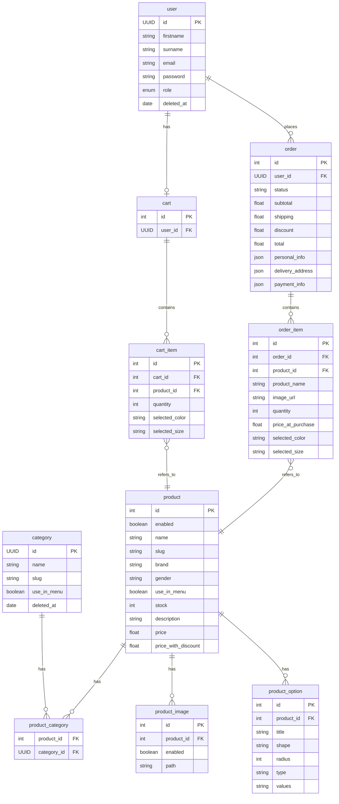

# 🛒 Digital Store — Projeto Back-end (API)

<div align="center">
  
  <br /><br />

  
  
  
  
  
  
  
  
  
</div>

<br />

> [!IMPORTANT]
> **Projeto Final — Geração Tech 3.0**
> Este repositório contém o **Back-end (API)** da plataforma **Digital Store**, desenvolvido como **Trabalho Final do Curso** do **Geração Tech 3.0**. Trata-se de um E-commerce para vestuário e acessórios.

---

## 📦 O Ecossistema Digital Store

O projeto **Digital Store** é composto por **3 repositórios independentes** que juntos formam um ecossistema completo de E-commerce:

| Repositório | Descrição | Responsável por |
|---|---|---|
| **🖥️ digital-store-frontend** [https://github.com/CaioIan/digital-store-frontend] | Interface do consumidor final | Navegação de produtos, carrinho, checkout, gestão de pedidos e perfil do usuário |
| **🔧 digital-store-api** (este repo) | API RESTful | Autenticação, CRUD de produtos, gestão de pedidos, controle de estoque, processamento de pagamentos e lógica de negócio |
| **📊 digital-store-admin** [https://github.com/CaioIan/digital-store-admin] | Painel administrativo | Cadastro/edição de produtos, gestão de categorias/marcas, visualização de pedidos e métricas do negócio |

### Como os projetos se conectam

```
┌──────────────────────┐         ┌──────────────────┐         ┌──────────────────────┐
│   Front-end Cliente  │◄───────►│    API (Back-end) │◄───────►│   Front-end Admin    │
│ (digital-store-frontend) │  HTTP   │   (Este repositório)  │  HTTP   │ (digital-store-admin)  │
│                      │ Cookies │                   │         │                      │
│  • Catálogo          │         │  • Auth JWT       │         │  • CRUD de Produtos  │
│  • Carrinho          │         │  • Rotas REST     │         │  • Gestão de Pedidos │
│  • Checkout          │         │  • Banco de Dados │         │  • Categorias/Marcas │
│  • Meus Pedidos      │         │  • Upload Imagens │         │  • Dashboard         │
│  • Perfil do Usuário │         │  • Validações     │         │                      │
└──────────────────────┘         └──────────────────┘         └──────────────────────┘
```

> O **Front-end do Cliente** consome a mesma API que o **Painel Admin**, porém com permissões e endpoints diferentes. A autenticação é feita via **HTTP-Only Cookies**, garantindo segurança contra ataques XSS. Para acesso ao painel administrativo, o login deve ser feito pela rota **`POST /v1/admin/login`**.

---

## Arquitetura

O projeto adota um padrão de **Arquitetura em Camadas (Layered Architecture)** fortemente inspirada e organizada no modelo **Domain-Driven Design (DDD) simplificado / Modular**, isolando responsabilidades para facilitar a manutenção e evolução da API.

### Organização de Camadas:
- **Routes (`routes/`):** Define os endpoints da API e orquestra a execução dos Middlewares e Controllers.
- **Controllers (`http/controllers/`):** Ponto de entrada das requisições. Extraem parâmetros (body, query, params) e invocam a camada de negócio (Services), retornando a resposta formatada ao cliente.
- **Validators & DTOs (`http/validators/` & `http/dto/`):** Validadores rigorosos usando Zod para garantir a integridade dos dados de entrada (Request) e saída (Response DTOs).
- **Services (`core/services/`):** Contém toda a regra de negócio da aplicação. Não conhecem detalhes de HTTP (req/res).
- **Repositories (`persistence/`):** Isola a comunicação direta com o ORM (Sequelize) e o banco de dados.
- **Models (`models/`):** Definição das entidades do banco e seus relacionamentos utilizando Sequelize.

### Fluxo de Requisição



---

## Tecnologias Utilizadas

- **Linguagem:** JavaScript (Node.js)
- **Framework principal:** Express.js `v5.x`
- **ORM:** Sequelize `v6.x`
- **Banco de dados:** MySQL `8.0`
- **Biblioteca de autenticação:** `jsonwebtoken` (JWT) & `bcrypt` (Hashing)
- **Biblioteca de validação:** `zod`
- **Integração de Mídia:** `cloudinary` & `multer`
- **Documentação:** `swagger-jsdoc` & `swagger-ui-express`
- **Testes:** `jest` e `supertest` (Cobertura Unitária e Integração)
- **Ferramentas de build/qualidade:** `@biomejs/biome` (Linter & Formatter), `nodemon`

---

## Estrutura de Pastas

```text
src/
 ├── config/            # Configurações gerais (Banco de Dados, Cloudinary, Swagger)
 ├── database/          # Configuração e inicialização da conexão com o banco
 ├── models/            # Modelos do Sequelize (Entidades e Associações)
 ├── modules/           # Módulos principais (DDD-like)
 │   ├── category/      # Módulo de Categorias
 │   ├── product/       # Módulo de Produtos
 │   └── user/          # Módulo de Usuários
 │       ├── core/          # Regras de Negócio (Services)
 │       ├── http/          # Camada de Apresentação (Controllers, DTOs, Validators)
 │       ├── persistence/   # Acesso a Dados (Repositories)
 │       └── routes/        # Rotas Express específicas do módulo
 ├── shared/            # Código compartilhado entre módulos
 │   ├── auth/          # Utilitários de JWT e Middlewares de autenticação
 │   └── middlewares/   # Middlewares globais (Error Handler, Role Guard, Upload)
 └── app.js & server.js # Arquivos de inicialização e montagem do Express
tests/                  # Suíte de testes (Integração e Unitários organizados por módulo / setup)
```

**Responsabilidade de cada camada no módulo:**
- `core/services`: Onde a regra de negócio realmente acontece (ex: validação se usuário existe antes de atualizar).
- `http/controllers`: Recebem requisições web, chamam os Services, e enviam a resposta (ex: `res.status(200).json(...)`).
- `http/validators`: Validam os dados enviados pelo cliente no formato correto (Body/Params/Query) usando Zod.
- `http/dto`: Garantem que o objeto de resposta devolvido não exponha dados sensíveis (como senhas).
- `persistence`: Abstração para buscas, inserções e deleções no Sequelize, separando o DB da regra de negócio.

---

## Requisitos

- **Ambiente:** Node.js (versão 18+ recomendada)
- **Banco de Dados:** MySQL 8.0 rodando localmente (ou via Docker)
- **Dependências Externas:** Conta no Cloudinary para realizar os uploads de imagens.

---

## Instalação

1. Clone o repositório:
```bash
git clone https://github.com/CaioIan/digital-store-api.git
cd digital-store-api
```

2. Instale as dependências:
```bash
npm install
```

3. Suba o ambiente do banco de dados (via Docker Compose):
```bash
docker-compose up -d
```

4. Acesse o container do app localmente (se aplicável) e rode as Migrations e Seeds (utilizando Sequelize-CLI se configurado no projeto) ou deixe o `sync()` rodar em desenvolvimento.

---

## Variáveis de Ambiente

Crie um arquivo `.env` na raiz do projeto contendo as seguintes variáveis:

| Variável | Obrigatória | Descrição |
|----------|-------------|-----------|
| `PORT` | Não | Porta em que o servidor Express irá rodar (Padrão: 3000) |
| `NODE_ENV` | Não | Ambiente de execução (`development`, `test`, `production`) |
| `DB_USER` | Sim | Usuário do MySQL (ex: `usuario_app`) |
| `DB_PASSWORD` | Sim | Senha do banco MySQL (ex: `senha_app`) |
| `DB_NAME` | Sim | Nome do banco principal (ex: `digital_store_db`) |
| `DB_HOST` | Sim | IP/Host do banco de dados (ex: `127.0.0.1`) |
| `DB_PORT` | Não | Porta do banco de dados (Padrão: 3306) |
| `DB_NAME_TEST`| Sim (em Teste) | Nome do banco dedicado para testes (ex: `digital_store_test`) |
| `JWT_SECRET` | Sim | Chave criptográfica secreta usada para assinar e verificar tokens JWT |
| `CLOUDINARY_CLOUD_NAME`| Sim | Nome da Cloud associada à conta no Cloudinary |
| `CLOUDINARY_API_KEY`| Sim | Chave de API do Cloudinary para uploads de Imagem |
| `CLOUDINARY_API_SECRET`| Sim | Secret de API do Cloudinary para validação do Upload |

---

## Como Executar a API

### Scripts Disponíveis (`package.json`)

- `npm run start:dev` : Inicia o servidor em modo de desenvolvimento utilizando `nodemon` (recarrega ao salvar arquivos).
- `npm run test` : Executa toda a suíte de testes (Integração e Unitários) utilizando Jest.
- `npm run test:watch` : Executa os testes em modo iterativo/observador.
- `npm run test:coverage` : Executa os testes e gera o relatório detalhado de cobertura de código (Coverage).
- `npm run test:ci` : Executa testes otimizados para pipelines de Integração Contínua.
- `npm run format` (e `format:files`) : Formata os arquivos do projeto de maneira padronizada com a ferramenta Biome.
- `npm run lint` / `npm run check` : Valida regras de código, potenciais erros usando BiomeLinter.

### Ambiente de Desenvolvimento local
1. Configure as variáveis de ambiente acima.
2. Inicie os containers Docker de DB: `docker-compose up -d`
3. Execute o projeto: `npm run start:dev`
4. Acesse: `http://localhost:3000/api-docs` para abrir a interface nativa do Swagger no Navegador.

---

## Documentação Completa dos Endpoints

Abaixo estão listados detalhadamente todos os endpoints disponíveis na aplicação.

### 🌐 Saúde da API

#### GET `/health`
- **Descrição:** Rota de Heartbeat/Health Check. Indica se a API está no ar e responsiva.
- **Autenticação:** Não
- **Response 200:**
```text
OK
```

---
### 👤 Módulo: Usuários (Users)

#### POST `/v1/user/login`
- **Descrição:** Gera o token JWT para acesso às rotas protegidas (Login).
- **Autenticação:** Não
- **Body:**
```json
{
  "email": "user@example.com",
  "password": "MinhaSenhaSuperSecreta"
}
```
- **Response 200:**
```json
{
  "token": "eyJhbG..",
  "user": {
    "id": "uuid-aqui",
    "firstname": "John",
    "surname": "Doe",
    "email": "user@example.com"
  }
}
```
- **Erros:** `401 Unauthorized` (Email/Senha inválidos).

#### POST `/v1/admin/login`
- **Descrição:** Realiza autenticação exclusiva do painel administrativo. Apenas usuários com role `ADMIN` podem iniciar sessão por esta rota.
- **Autenticação:** Não
- **Body:**
```json
{
  "email": "admin@example.com",
  "password": "MinhaSenhaSuperSecreta"
}
```
- **Response 200:**
```json
{
  "user": {
    "id": "uuid-aqui",
    "firstname": "Admin",
    "surname": "User",
    "email": "admin@example.com",
    "cpf": "00000000000",
    "phone": "85999999999"
  }
}
```
- **Erros:** `401 Unauthorized` (Credenciais inválidas) | `403 Forbidden` (Usuário sem permissão de ADMIN).

#### POST `/v1/user`
- **Descrição:** Cadastro de um novo Usuário (Role padrão: `USER`).
- **Autenticação:** Não
- **Middlewares:** `createUserValidator`
- **Body:**
```json
{
  "firstname": "John",
  "surname": "Doe",
  "email": "john.doe@example.com",
  "password": "senha",
  "confirmPassword": "senha"
}
```
- **Response 201:**
```json
{
  "id": "uuid",
  "firstname": "John",
  "surname": "Doe",
  "email": "john.doe@example.com"
}
```
- **Erros:** `400 Bad Request` (Senhas não colidem, dados faltantes) | `409 Conflict` (Email já existente).

#### GET `/v1/user/:id`
- **Descrição:** Busca detalhes do perfil de um usuário específico.
- **Autenticação:** Sim (Bearer Token)
- **Parâmetros de rota:** `id` (UUID do usuário).
- **Response 200:**
```json
{
  "id": "uuid",
  "firstname": "John",
  "surname": "Doe",
  "email": "john@email.com"
}
```
- **Erros:** `401 Unauthorized` | `404 Not Found`.

#### PATCH `/v1/user/:id`
- **Descrição:** Atualiza parcialmente os dados do usuário. (Apenas campos enviados serão modificados).
- **Autenticação:** Sim (Bearer Token)
- **Middlewares:** `updateUserValidator`
- **Parâmetros de rota:** `id` (UUID)
- **Body:** *(Todos campos são opcionais)*
```json
{
  "firstname": "John Updated",
  "surname": "Doe Updated",
  "email": "novo@email.com"
}
```
- **Response 204:** No Content.
- **Erros:** `400 Bad Request` | `401 Unauthorized` | `404 Not Found` | `409 Conflict` (Email já em uso).

#### DELETE `/v1/user/:id`
- **Descrição:** Realiza a exclusão lógica (Soft Delete) do usuário do sistema preenchendo o `deleted_at`.
- **Autenticação:** Sim (Bearer Token)
- **Parâmetros de rota:** `id` (UUID)
- **Response 204:** No Content.
- **Erros:** `401 Unauthorized` | `404 Not Found`.

---
### 🗂 Módulo: Categorias (Categories)

#### POST `/v1/category`
- **Descrição:** Cria uma nova categoria de produtos.
- **Autenticação:** Sim (Bearer Token)
- **Middlewares:** `roleGuardMiddleware("ADMIN")`, `createCategoryValidator`
- **Body:**
```json
{
  "name": "Tênis Esportivos",
  "slug": "tenis-esportivos",
  "use_in_menu": true
}
```
- **Response 201:**
```json
{
  "id": "uuid",
  "name": "Tênis Esportivos",
  "slug": "tenis-esportivos",
  "use_in_menu": true
}
```
- **Erros:** `400 Bad Request` | `401 Unauthorized` | `403 Forbidden` | `409 Conflict` (Slug existente).

#### GET `/v1/category/search`
- **Descrição:** Busca paginada e com múltiplos filtros por categorias.
- **Autenticação:** Sim (Bearer Token)
- **Middlewares:** `searchCategoryValidator`
- **Query Params:**
  - `limit` (int, default 12, use -1 para ignorar limite)
  - `page` (int, default 1)
  - `fields` (string separada por vírgula. Ex: `name,slug`)
  - `use_in_menu` ("true")
- **Response 200:**
```json
{
  "data": [
    {
      "id": "uuid",
      "name": "Tênis",
      "slug": "tenis",
      "use_in_menu": true
    }
  ],
  "total": 1,
  "limit": 12,
  "page": 1
}
```
- **Erros:** `400 Bad Request` | `401 Unauthorized`.

#### GET `/v1/category/:id`
- **Descrição:** Busca uma categoria específica pelo seu UUID.
- **Autenticação:** Sim (Bearer Token)
- **Parâmetros de rota:** `id` (UUID)
- **Response 200:** (Semelhante ao POST /category)
- **Erros:** `400 Bad Request` (UUID falho) | `404 Not Found`.

#### PATCH `/v1/category/:id`
- **Descrição:** Atualiza parcialmente uma Categoria existente.
- **Autenticação:** Sim (Bearer Token)
- **Middlewares:** `roleGuardMiddleware("ADMIN")`, `updateCategoryValidator`
- **Parâmetros de rota:** `id` (UUID)
- **Body:** (Opcional)
```json
{
  "name": "Tênis Casual",
  "use_in_menu": false
}
```
- **Response 204:** No Content.
- **Erros:** `400 Bad Request` | `403 Forbidden` | `404 Not Found` | `409 Conflict`.

#### DELETE `/v1/category/:id`
- **Descrição:** Deleta suavemente (Soft Delete) uma categoria existente.
- **Autenticação:** Sim (Bearer Token)
- **Middlewares:** `roleGuardMiddleware("ADMIN")`
- **Parâmetros de rota:** `id` (UUID)
- **Response 204:** No Content.
- **Erros:** `403 Forbidden` | `404 Not Found`.

---
### 📦 Módulo: Produtos (Products)

#### POST `/v1/product`
- **Descrição:** Criação completa de um produto incluindo associações de imagens, opções e categorias.
- **Autenticação:** Sim (Bearer Token)
- **Middlewares:** `roleGuardMiddleware("ADMIN")`, `createProductValidator`
- **Body:**
```json
{
  "enabled": true,
  "name": "K-Swiss V8 - Masculino",
  "slug": "k-swiss-v8-masculino",
  "stock": 43,
  "description": "Lorem ipsum dolor...",
  "price": 200,
  "price_with_discount": 149.9,
  "category_ids": [
    "uuid_da_categoria_aqui"
  ],
  "images": [
    {
      "type": "image/jpeg",
      "content": "http://res.cloudinary.com/....jpg"
    }
  ],
  "options": [
    {
      "title": "Cor",
      "shape": "circle",
      "radius": 4,
      "type": "color",
      "values": ["#111111", "#ff0000"]
    }
  ]
}
```
- **Regras importantes:**
  - `category_ids` é obrigatório e deve conter pelo menos 1 UUID válido.
  - `options[].category_id` é opcional.
- **Response 201:** Retorna o status `201 Created` e os dados serializados do produto em JSON.
- **Erros:** `400 Bad Request` | `403 Forbidden` | `409 Conflict` | `404 Not Found` (Categoria não encontrada).

#### POST `/v1/product/upload-image`
- **Descrição:** Upload de imagens físicas (multipart) ou via Base64 para hospedagem no Cloudinary. Limite de 10 arquivos.
- **Autenticação:** Sim (Bearer Token)
- **Middlewares:** `roleGuardMiddleware("ADMIN")`, `upload.array("images", 10)`, `uploadImageValidator`
- **Body Multi-part (`form-data`):**
  - Chave: `images` (Array de File/Binary)
- **Body JSON (Base64 Alternative):**
```json
{
  "type": "image/jpeg",
  "content": "Base64ContentHere"
}
```
- **Response 200:** Retorna detalhes da Hospedagem do CDN
```json
[
  {
    "url": "http://res.cloudinary.com/...",
    "public_id": "products/random_id"
  }
]
```

#### GET `/v1/product/search`
- **Descrição:** Motor de busca poderoso de produtos na loja. Permite pesquisar por query, filtrar itens dentro de limites de preços (`min-max`), filtrar categorias por UUID (`category_ids`), marca, gênero e combinar opções dinâmicas.
- **Autenticação:** Não (Pública)
- **Middlewares:** `searchProductValidator`
- **Query Params:**
  - `limit` (padrão: 12)
  - `page` (padrão: 1)
  - `fields` (string. ex: `name,price`)
  - `match` (string, pesquisa LIKE % % no titulo e descricão)
  - `category_ids` (Lista de categorys UUIDs CSV)
  - `brand` (string, filtro exato por marca. ex: `Puma`)
  - `gender` (Enum: `Masculino`, `Feminino`, `Unisex`)
  - `price-range` (string formato min-max. Ex: `100-200`)
  - `option[ID]=valor` (Múltiplas sub-buscas nas chaves de opções JSON)
- **Response 200:**
```json
{
  "data": [
    {
      "id": 1,
      "name": "K-Swiss V8 - Masculino",
      "slug": "k-swiss-v8",
      "price": 200,
      "price_with_discount": 149.9,
      "images": [],
      "options": [],
      "categories": []
    }
  ],
  "total": 1,
  "limit": 12,
  "page": 1
}
```

#### GET `/v1/product/:id`
- **Descrição:** Obtém todos os detalhes ricos de um único Produto, suas Associações de Categoria, Imagens e Formatações de Opções.
- **Autenticação:** Não (Pública)
- **Parâmetros de rota:** `id` (INTEGER ID do produto).
- **Response 200:** Retorna os detalhes da entidade Product com Includes aninhados completando Options, Images e Category.

#### PATCH `/v1/product/:id`
- **Descrição:** Modifica os atributos de um produto bem como reprocessa todas suas Entidades relacionadas. Atualizações nas imagens/categorias substituem atomicamente em uma Transação SQL as ligações antigas pelas novas requisitadas.
- **Autenticação:** Sim (Bearer Token)
- **Middlewares:** `roleGuardMiddleware("ADMIN")`, `updateProductValidator`
- **Body:** Mesmo schema flexível do Cadastro Completo de Produto.
- **Response 204:** No Content.

#### DELETE `/v1/product/:id`
- **Descrição:** Remove fisicamente (Hard Delete Cascade Mode) um produto logado, propagando ao banco a deleção de todas Imagens, Opções listadas e Links na tabela de Categorias desse Produto.
- **Autenticação:** Sim (Bearer Token)
- **Middlewares:** `roleGuardMiddleware("ADMIN")`
- **Response 204:** No Content.

---
### 🛒 Módulo: Carrinho (Cart)

#### GET `/v1/cart`
- **Descrição:** Retorna o estado atual do carrinho do usuário autenticado (incluindo cálculo de totais em tempo real).
- **Autenticação:** Sim (Bearer Token)

#### POST `/v1/cart/add`
- **Descrição:** Adiciona um novo produto ou incrementa a quantidade caso o mesmo já exista no carrinho.
- **Autenticação:** Sim (Bearer Token)
- **Body Exemplo:** `{"product_id": 1, "quantity": 1, "selected_color": "#000000", "selected_size": "40"}`

#### PUT `/v1/cart/update/:itemId`
- **Descrição:** Atualiza a quantidade de um item já existente no carrinho.
- **Autenticação:** Sim (Bearer Token)

#### DELETE `/v1/cart/remove/:itemId`
- **Descrição:** Remove completamente um item do carrinho.
- **Autenticação:** Sim (Bearer Token)

#### DELETE `/v1/cart/clear`
- **Descrição:** Limpa todos os itens do carrinho do usuário.
- **Autenticação:** Sim (Bearer Token)

---
### 🚚 Módulo: Pedidos (Orders)

#### POST `/v1/orders`
- **Descrição:** Realiza o "Checkout". Converte os itens do Carrinho em um pedido fechado, calculando totais de pagamento e salvando o histórico unificado. Em seguida, limpa o carrinho.
- **Autenticação:** Sim (Bearer Token)
- **Body Exemplo:** `{"personal_info": {...}, "delivery_address": {...}, "payment_info": {...}}`

#### GET `/v1/orders`
- **Descrição:** Lista o histórico de pedidos efetuados pelo usuário autenticado, ordenados do mais recente ao mais antigo com paginação.
- **Autenticação:** Sim (Bearer Token)
- **Query Params:**
  - `limit` (padrão: 10)
  - `page` (padrão: 1)

#### GET `/v1/orders/:id`
- **Descrição:** Obtém os detalhes completos de um pedido fechado. Só permite visualização se o pedido pertencer ao usuário (ou se for papel ADMIN).
- **Autenticação:** Sim (Bearer Token)

---

## Banco de Dados

A API utiliza amplamente banco Relacional suportado pelo `MySQL` governado pelo ORM `Sequelize`.

### Modelos / Entidades Principais
- **User:** Perfil do administrador e clientes convencionais (Controlado via Soft-Delete `paranoid: true`).
- **Category:** Árvore de ramificação das categorias do sistema (Soft-Deleted `paranoid: true`).
- **Product:** Inventário contendo preços, descontos, flags de status e estoque.
- **ProductImage:** Controle N:1 (Filho para pai) referenciando os Assets/URLs gerados no Cloudinary por produto.
- **ProductOption:** Possibilita que um Produto tenha múltiplos sub-variações estruturalmente descritivas com JSON/String (Tamanhos 39, 40 / Cores Azul, Vermelha).
- **ProductCategory** (Through Table / Pivot): Tabela agregadora de relacionamento Muitos-Para-Muitos (N:N) que lida com as Associações de Várias Categorias sendo marcadas por Vários Produtos simultaneamente.
- **Cart & CartItem:** Controle temporário do carrinho de compras ativo dos usuários.
- **Order & OrderItem:** Registro histórico permanente e imutável de uma transação finalizada via Checkout.

### Diagrama ER


---

## Autenticação e Autorização

- **Tipo:** JWT (JSON Web Token) via Header `Authorization: Bearer <Token>`.
- **Fluxo de autenticação:** O Cliente realiza login (`/v1/user/login`). A API retorna o JWT assinado (`jsonwebtoken`). Em chamadas subsequentes protegidas, o `authVerificationMiddleware` valida a integridade, não-expiração e extrai o `req.user`.
- **Estratégia de autorização:** Os usuários contam com enumeração de Roles estritas (`USER` e `ADMIN`). O Middleware **`roleGuardMiddleware`** impede clientes do tipo `USER` comum de efetuarem alterações massivas (Cadastrar Produtos, Modificar Categorias). Modificações de próprio perfil e exclusão estão acessíveis checando internamente autorizações granulares pelo UUID no próprio Controller/Service.

---

## Middlewares

- `auth-verification.middleware.js`: Intercepta o request verificando presença e expiração de assinaturas JWT. Carrega dados validados do User ativo.
- `role-guard.middleware.js`: Fábrica de bloqueio de Rotas que aceita um array limitador de roles necessárias. Gera Erro Restrito (`403 Forbidden`).
- `error-handler.middleware.js`: Padrão concentrado global que unifica erros disparados pelo Express, retornando formatação HTTP padronizada (Error handling).
- `async-handler.middleware.js`: Simplifica Controllers capturando erros subjacentes de Async/Await e repassando para o Error Handler.
- `upload.middleware.js`: Faz bridge com o `multer`, aplica filtro rigoroso de tipagem Restrita apenas a `image/jpeg|png|webp|svg` barrando scripts nocivos.


---

## Tratamento de Erros

A API possui uma **estratégia global e unificada** via Middleware (`error-handler`).

- Em Serviços, classes de exceção especializadas como Entidades Not-Found explodem erros conhecidos (ou status HTTP diretamente) que bolham à Camada do Express.
- Zod Validators devolvem padronizados e interceptados o status Rest API apropriado: `400 Bad Request` com Field/Messages mapeados.
- Se fora de Contexto Seguro: `500 Server Error Internal` é devolvido blindando detalhes ocultos/internos na versão Prod (StackTraces somem de res).
- **Códigos Comuns:**
  - `400`: Payload falhou validações Zod ou falha lógica Negócio.
  - `401`: JWT Ausente/Expirou.
  - `403`: Papel (Role) Sem Acesso Privilegiado.
  - `404`: UUID não constam do Banco na Tabela informada.
  - `409`: Violação Unique Constraint (Emails duplicados / Slugs Indisponíveis).

---

## Testes

- **Framework Utilizado:** **Jest** (Test Runner + Asserções) integrado ao **Supertest** (Requests do ambiente Express Mockado de forma Integrativa/End-to-end).
- **Cobertura:** Extensiva, segmentando em Suítes por Cada Modulo em Abordagem:
  - **Unidade (Unit):** Validam regras de negócios no `[módulo].service.spec.js` interceptando chamadas aos Repository Methods.
  - **Integração (Int/E2E):** Validam as Requisições completas das `/routes.int.spec.js` subindo o ambiente Expresso junto a Bancos `digital_store_db_test` em Containers DB Isolados disparando Inserções e Confirmações Finais diretas, com Limpeza do Setup/Teardown global e Transações nativas no Banco (Serial).
- **Como rodar:** `npm run test`.
- A API conta com mais de 160+ Assertions rodando na suite global perfeitamente controlados.

---

## Segurança

- **Proteção Criptográfica:** Salvas as senhas via Hash `bcrypt` (`genSalt(10)`) rodando diretamente de `hooks` Nativo Sequelize (Never-expose-passwords approach).
- **Validações Fortes:** Validação imperativa Typescript-like de Request Body por Schema ZOD com `.strict()` descartando/limpando Injection via Atributos Estranhos mass-assign, mitigação de Poluição e restrição de tipagem profunda.
- **Sanitização Básica Uploads:** O backend nega uploads com MimeTypes não explicitamente homologados (Anti-Webshells). Autentica no backend Third-Party CDN (Cloudinary).
- *Rate Limiting / CORS*: No estado atual, configuráveis via reverse-proxy ou Ingress-controllers nas frentes Cloud Native; Código nativo sem Middlewares obstrutivos limitadores.

---

## Build e Deploy

- O projeto não requer um passo de "build" JS pesado (como Typescript, embora seja JS Vanilla moderno). Pode rodar diretamente o código-fonte via Node `v18+`.
- A API está empacotada com receita `Docker-Compose` subindo Serviços Auxiliares, o que a torna `Docker-Ready`. Crie uma `Dockerfile` caso deseje containerização da Stack Front-Web e Deploy em Orquestradores como Heroku, ECS Fargate ou DO App-Platform apontando p/ `npm run start:dev` vs `npm start`.

---

## Licença

Projeto regido sob a Licença Pública ISC padrão. 

---
**Autor**: Desenvolvido sob esforço Open-Source e Arquitetural por *Caio Ian Oliveira dos Santos*.
