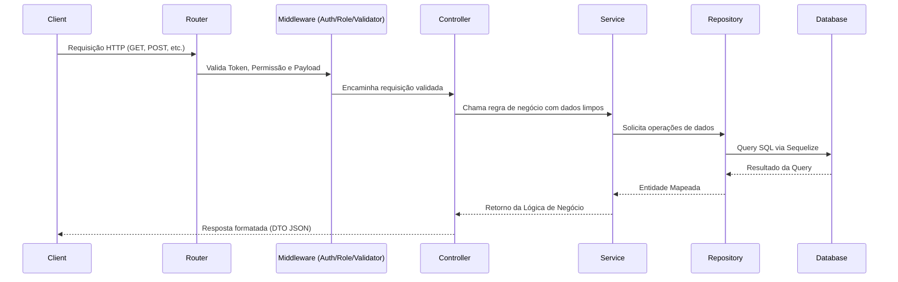
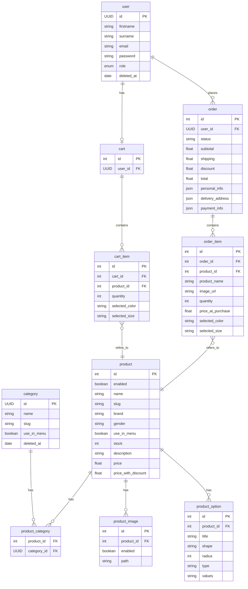

# Digital Store — API (Back-end)

<div align="center">
  <br />

  
  
  
  
  
  
  
</div>

<br />

> [!IMPORTANT]
> **Projeto Final — Geração Tech 3.0**
> Este repositório contém a **API (Back-end)** da plataforma **Digital Store**, desenvolvida como **Trabalho Final do Curso** do **Geração Tech 3.0**. Trata-se do motor central que gerencia toda a lógica de negócio, persistência de dados e segurança do E-commerce.

---

## 📦 O Ecossistema Digital Store

O projeto **Digital Store** é composto por **3 repositórios independentes** que juntos formam um ecossistema completo de E-commerce:

| Repositório | Descrição | Responsável por |
|---|---|---|
| **🔧 digital-store-api** (este repo) | API RESTful | Autenticação, CRUD de produtos, gestão de pedidos, controle de estoque, processamento de pagamentos e lógica de negócio |
| **🖥️ digital-store-frontend** | Interface do consumidor final | Navegação de produtos, carrinho, checkout, gestão de pedidos e perfil do usuário |
| **📊 digital-store-admin** | Painel administrativo | Cadastro/edição de produtos, gestão de categorias/marcas, visualização de pedidos e métricas do negócio |

### Como os projetos se conectam

```
┌──────────────────────┐         ┌──────────────────┐         ┌──────────────────────┐
│   Front-end Cliente  │◄───────►│    API (Back-end) │◄───────►│   Front-end Admin    │
│                      │  HTTP   │ (Este repositório)│  HTTP   │  (Painel do Gestor)  │
│                      │ Cookies │                   │         │                      │
│  • Catálogo          │         │  • Auth JWT       │         │  • CRUD de Produtos  │
│  • Carrinho          │         │  • Rotas REST     │         │  • Gestão de Pedidos │
│  • Checkout          │         │  • Banco de Dados │         │  • Categorias/Marcas │
│  • Meus Pedidos      │         │  • Upload Imagens │         │  • Dashboard         │
│  • Perfil do Usuário │         │  • Validações     │         │                      │
└──────────────────────┘         └──────────────────┘         └──────────────────────┘
```

> O **Back-end (API)** é o núcleo central que atende tanto o Front-end do Cliente quanto o Painel Admin. A autenticação é feita via **HTTP-Only Cookies** e **Bearer Tokens**, garantindo segurança e flexibilidade para as diferentes interfaces.

---

## Descrição Geral

A Digital Store API é o backend centralizado de um sistema de loja virtual. Ela fornece funcionalidades robustas para o gerenciamento de produtos, categorias (departamentos) e usuários, com suporte completo a autenticação JWT, uploads de imagens integrados ao Cloudinary, e controle de acesso baseado em Roles (RBAC - User/Admin).

---

## Arquitetura

O projeto adota um padrão de **Arquitetura em Camadas (Layered Architecture)** fortemente inspirada e organizada no modelo **Domain-Driven Design (DDD) simplificado / Modular**, isolando responsabilidades para facilitar a manutenção e evolução da API.

### Organização de Camadas:
- **Routes (`routes/`):** Define os endpoints da API e orquestra a execução dos Middlewares e Controllers.
- **Controllers (`http/controllers/`):** Ponto de entrada das requisições. Extraem parâmetros (body, query, params) e invocam a camada de negócio (Services), retornando a resposta formatada ao cliente.
- **Validators & DTOs (`http/validators/` & `http/dto/`):** Validadores rigorosos usando Zod para garantir a integridade dos dados de entrada (Request) e saída (Response DTOs).
- **Services (`core/services/`):** Contém toda a regra de negócio da aplicação. Não conhecem detalhes de HTTP (req/res).
- **Repositories (`persistence/`):** Isola a comunicação direta com o ORM (Sequelize) e o banco de dados.
- **Models (`models/`):** Definição das entidades do banco e seus relacionamentos utilizando Sequelize.

### Convenção de Organização das Rotas

Nos arquivos de rotas de cada módulo (`src/modules/*/routes/*.routes.js`), os endpoints estão organizados em blocos na seguinte ordem:

1. **Rotas de ADMIN (Protegidas)**
2. **Rotas Protegidas**
3. **Rotas Públicas**

Observações:
- Nem todo módulo possui os três tipos de rota. Nesses casos, apenas os blocos existentes são mantidos.
- Essa organização é uma convenção de legibilidade/manutenção e não altera as regras de negócio dos serviços.
- Os blocos são identificados por comentários no código para facilitar navegação e revisão.

### Fluxo de Requisição



---

## Tecnologias Utilizadas

- **Linguagem:** JavaScript (Node.js)
- **Framework principal:** Express.js `v5.x`
- **ORM:** Sequelize `v6.x`
- **Banco de dados:** MySQL `8.0`
- **Biblioteca de autenticação:** `jsonwebtoken` (JWT), `bcrypt` (Hashing) & `cookie-parser`
- **Biblioteca de envio de email:** `resend` (SDK oficial do Resend)
- **Biblioteca de validação:** `zod`
- **Controle de Taxa:** `express-rate-limit`
- **Identificadores Únicos:** `uuid`
- **Integração de Mídia:** `cloudinary` & `multer`
- **Documentação:** `swagger-jsdoc` & `swagger-ui-express`
- **Testes:** `jest` e `supertest` (Cobertura Unitária e Integração)
- **Ferramentas de build/qualidade:** `@biomejs/biome` (Linter & Formatter), `nodemon`

---

## Estrutura de Pastas

```text
src/
 ├── config/            # Configurações gerais (Banco de Dados, Cloudinary, Swagger, Email)
 ├── database/          # Configuração e inicialização da conexão com o banco
 ├── models/            # Modelos do Sequelize (Entidades e Associações)
 ├── modules/           # Módulos principais (DDD-like)
 │   ├── category/      # Módulo de Categorias
 │   ├── product/       # Módulo de Produtos
 │   └── user/          # Módulo de Usuários
 │       ├── core/          # Regras de Negócio (Services)
 │       ├── http/          # Camada de Apresentação (Controllers, DTOs, Validators)
 │       ├── persistence/   # Acesso a Dados (Repositories)
 │       └── routes/        # Rotas Express específicas do módulo
 ├── shared/            # Código compartilhado entre módulos
 │   ├── auth/          # Utilitários de JWT e Middlewares de autenticação
 │   ├── config/        # Configurações de features e ambiente (email.config.js)
 │   ├── providers/     # Provedores de terceiros (EmailProvider, etc)
 │   └── middlewares/   # Middlewares globais (Error Handler, Role Guard, Upload)
 └── app.js & server.js # Arquivos de inicialização e montagem do Express
tests/                  # Suíte de testes (Integração e Unitários organizados por módulo / setup)
```

**Responsabilidade de cada camada no módulo:**
- `core/services`: Onde a regra de negócio realmente acontece (ex: validação se usuário existe antes de atualizar).
- `http/controllers`: Recebem requisições web, chamam os Services, e enviam a resposta (ex: `res.status(200).json(...)`).
- `http/validators`: Validam os dados enviados pelo cliente no formato correto (Body/Params/Query) usando Zod.
- `http/dto`: Garantem que o objeto de resposta devolvido não exponha dados sensíveis (como senhas).
- `persistence`: Abstração para buscas, inserções e deleções no Sequelize, separando o DB da regra de negócio.

---

## Requisitos

- **Ambiente:** Node.js (versão 18+ recomendada)
- **Banco de Dados:** MySQL 8.0 rodando localmente (ou via Docker)
- **Dependências Externas:** 
  - Conta no Cloudinary para realizar uploads de imagens
  - Conta no Resend para envio de emails de verificação e transacionais

---

## Instalação

1. Clone o repositório:
```bash
git clone https://github.com/CaioIan/digital-store-api.git
cd digital-store-api
```

2. Instale as dependências:
```bash
npm install
```

3. Suba o ambiente do banco de dados (via Docker Compose):
```bash
docker-compose up -d
```

4. Acesse o container do app localmente (se aplicável) e rode as Migrations e Seeds (utilizando Sequelize-CLI se configurado no projeto) ou deixe o `sync()` rodar em desenvolvimento.

---

## Variáveis de Ambiente

Crie um arquivo `.env` na raiz do projeto contendo as seguintes variáveis:

| Variável | Obrigatória | Exemplo | Descrição |
|----------|-------------|---------|-----------|
| `PORT` | Não | `3000` | Porta em que o servidor Express irá rodar |
| `NODE_ENV` | Não | `development` | Ambiente de execução (`development`, `test`, `production`) |
| `API_URL` | Sim | `http://localhost:3000` | URL base da API (usada para links de verificação de email) |
| `FRONTEND_URL` | Sim | `http://localhost:5173` | URL base do Front-end (usada em configurações de CORS) |
| `DB_USER` | Sim | `root` | Usuário do MySQL |
| `DB_PASSWORD` | Sim | `password` | Senha do banco MySQL |
| `DB_NAME` | Sim | `digital_store_db` | Nome do banco principal |
| `DB_HOST` | Sim | `localhost` | Host do banco de dados |
| `DB_PORT` | Não | `3306` | Porta do banco de dados |
| `DB_NAME_TEST`| Sim (em Teste) | `digital_store_test` | Banco dedicado para testes |
| `JWT_SECRET` | Sim | `suasecreta` | Chave usada para assinar tokens JWT |
| `CLOUDINARY_CLOUD_NAME`| Sim | `nome_da_nuvem` | Identificador da conta no Cloudinary |
| `CLOUDINARY_API_KEY`| Sim | `12345678` | Chave de API do Cloudinary |
| `CLOUDINARY_API_SECRET`| Sim | `secret_aqui` | Segredo de API do Cloudinary |
| `RESEND_API_KEY` | Sim | `re_xxxxx...` | Chave de API do serviço Resend para envio de emails |
| `MAIL_FROM` | Sim | `Digital Store <onboarding@resend.dev>` | Email remetente para envio de mensagens |
| `EMAIL_VERIFICATION_ENABLED` | Não | `true` | Feature flag para exigir verificação de email (`true` = produção, `false` = demonstração) |

---

## Como Executar a API

### Scripts Disponíveis (`package.json`)

- `npm run start:dev` : Inicia o servidor em modo de desenvolvimento utilizando `nodemon` (recarrega ao salvar arquivos).
- `npm run test` : Executa toda a suíte de testes (Integração e Unitários) utilizando Jest.
- `npm run test:watch` : Executa os testes em modo iterativo/observador.
- `npm run test:coverage` : Executa os testes e gera o relatório detalhado de cobertura de código (Coverage).
- `npm run test:ci` : Executa testes otimizados para pipelines de Integração Contínua.
- `npm run format` (e `format:files`) : Formata os arquivos do projeto de maneira padronizada com a ferramenta Biome.
- `npm run lint` / `npm run check` : Valida regras de código, potenciais erros usando BiomeLinter.

### Ambiente de Desenvolvimento local
1. Configure as variáveis de ambiente acima.
2. Inicie os containers Docker de DB: `docker-compose up -d`
3. Execute o projeto: `npm run start:dev`
4. Acesse: `http://localhost:3000/api-docs` para abrir a interface nativa do Swagger no Navegador.

---

## Documentação Completa dos Endpoints

Abaixo estão listados detalhadamente todos os endpoints disponíveis na aplicação.

### 🌐 Saúde da API

#### GET `/health`
- **Descrição:** Rota de Heartbeat/Health Check. Indica se a API está no ar e responsiva.
- **Autenticação:** Não
- **Response 200:**
```text
OK
```

---
### 👤 Módulo: Usuários (Users)

#### POST `/v1/user/login`
- **Descrição:** Autentica o usuário e gera um token JWT. O token é retornado no corpo da resposta e também assinado em um cookie `access_token` HTTP-Only para maior segurança.
- **Autenticação:** Não
- **Middlewares:** `authLimiter` (Rate limit restrito para login)
- **Body:**
```json
{
  "email": "user@example.com",
  "password": "SenhaDoUsuario"
}
```
- **Response 200:**
```json
{
  "token": "eyJhbG..",
  "user": {
    "id": "uuid",
    "firstname": "John",
    "surname": "Doe",
    "email": "user@example.com"
  }
}
```

#### POST `/v1/user/logout`
- **Descrição:** Limpa o cookie de autenticação `access_token` no navegador do usuário.
- **Autenticação:** Não (Pública)
- **Response 204:** No Content.

#### GET `/v1/user/verify-email`
- **Descrição:** Endpoint acessado via link enviado por e-mail para validar a conta do usuário.
- **Autenticação:** Não (Token via Query String)
- **Parâmetros:** `token` (JWT sem estado)
- **Response 200:** (Retorna página HTML de sucesso)
- **Response 400:** (Retorna página HTML de erro/expiração)
- **Erros:** `400 Bad Request` (Email/Senha inválidos) | `404 Not Found` (Usuário não existe).

#### POST `/v1/user`
- **Descrição:** Cadastro de um novo Usuário (Role padrão: `USER`). A resposta varia baseada na feature flag `EMAIL_VERIFICATION_ENABLED`.
- **Autenticação:** Não
- **Middlewares:** `createUserValidator`
- **Body:**
```json
{
  "firstname": "John",
  "surname": "Doe",
  "email": "john.doe@example.com",
  "password": "senha",
  "confirmPassword": "senha"
}
```
- **Response 201 (Modo: EMAIL_VERIFICATION_ENABLED=true):**
```json
{
  "user": {
    "id": "uuid",
    "firstname": "John",
    "surname": "Doe",
    "cpf": "12345678900",
    "phone": "11999999999",
    "email": "john.doe@example.com",
    "addresses": []
  },
  "message": "Email de verificação enviado para john.doe@example.com. Por favor, clique no link recebido para ativar sua conta."
}
```
- **Response 201 (Modo: EMAIL_VERIFICATION_ENABLED=false):**
```json
{
  "user": {
    "id": "uuid",
    "firstname": "John",
    "surname": "Doe",
    "cpf": "12345678900",
    "phone": "11999999999",
    "email": "john.doe@example.com",
    "addresses": []
  }
}
```
- **Detectando o Modo no Frontend:** Se a resposta contém campo `message`, significa que a verificação de email está habilitada. Se não contém, está desabilitada.
- **Erros:** `400 Bad Request` (Senhas não colidem, dados faltantes) | `409 Conflict` (Email já existente).

#### GET `/v1/user/:id`
- **Descrição:** Busca detalhes do perfil de um usuário específico.
- **Autenticação:** Sim (Bearer Token)
- **Parâmetros de rota:** `id` (UUID do usuário).
- **Response 200:**
```json
{
  "id": "uuid",
  "firstname": "John",
  "surname": "Doe",
  "email": "john@email.com"
}
```
- **Erros:** `401 Unauthorized` | `404 Not Found`.

#### PATCH `/v1/user/:id`
- **Descrição:** Atualiza parcialmente os dados do usuário. (Apenas campos enviados serão modificados).
- **Autenticação:** Sim (Bearer Token)
- **Middlewares:** `updateUserValidator`
- **Parâmetros de rota:** `id` (UUID)
- **Body:** *(Todos campos são opcionais)*
```json
{
  "firstname": "John Updated",
  "surname": "Doe Updated",
  "email": "novo@email.com"
}
```
- **Response 204:** No Content.
- **Erros:** `400 Bad Request` | `401 Unauthorized` | `404 Not Found` | `409 Conflict` (Email já em uso).

#### DELETE `/v1/user/:id`
- **Descrição:** Realiza a exclusão lógica (Soft Delete) do usuário do sistema preenchendo o `deleted_at`.
- **Autenticação:** Sim (Cookie ou Bearer Token)
- **Parâmetros de rota:** `id` (UUID)
- **Response 204:** Sem Conteúdo (No Content).
- **Erros:** `401 Unauthorized` | `404 Not Found`.

#### GET `/v1/admin/users`
- **Descrição:** Lista todos os usuários cadastrados no sistema. (Apenas para Administradores).
- **Autenticação:** Sim (Role ADMIN)
- **Query Params:** `limit`, `page`.
- **Response 200:** Lista paginada de usuários.

---
### 🗂 Módulo: Categorias (Categories)

#### POST `/v1/category`
- **Descrição:** Cria uma nova categoria de produtos.
- **Autenticação:** Sim (Bearer Token)
- **Middlewares:** `roleGuardMiddleware("ADMIN")`, `createCategoryValidator`
- **Body:**
```json
{
  "name": "Tênis Esportivos",
  "slug": "tenis-esportivos",
  "use_in_menu": true
}
```
- **Response 201:**
```json
{
  "id": "uuid",
  "name": "Tênis Esportivos",
  "slug": "tenis-esportivos",
  "use_in_menu": true
}
```
- **Erros:** `400 Bad Request` | `401 Unauthorized` | `403 Forbidden` | `409 Conflict` (Slug existente).

#### GET `/v1/category/search`
- **Descrição:** Busca paginada e com múltiplos filtros por categorias.
- **Autenticação:** Sim (Bearer Token)
- **Middlewares:** `searchCategoryValidator`
- **Query Params:**
  - `limit` (int, default 12, use -1 para ignorar limite)
  - `page` (int, default 1)
  - `fields` (string separada por vírgula. Ex: `name,slug`)
  - `use_in_menu` ("true")
- **Response 200:**
```json
{
  "data": [
    {
      "id": "uuid",
      "name": "Tênis",
      "slug": "tenis",
      "use_in_menu": true
    }
  ],
  "total": 1,
  "limit": 12,
  "page": 1
}
```
- **Erros:** `400 Bad Request` | `401 Unauthorized`.

#### GET `/v1/category/:id`
- **Descrição:** Busca uma categoria específica pelo seu UUID.
- **Autenticação:** Sim (Bearer Token)
- **Parâmetros de rota:** `id` (UUID)
- **Response 200:** (Semelhante ao POST /category)
- **Erros:** `400 Bad Request` (UUID falho) | `404 Not Found`.

#### PATCH `/v1/category/:id`
- **Descrição:** Atualiza parcialmente uma Categoria existente.
- **Autenticação:** Sim (Bearer Token)
- **Middlewares:** `roleGuardMiddleware("ADMIN")`, `updateCategoryValidator`
- **Parâmetros de rota:** `id` (UUID)
- **Body:** (Opcional)
```json
{
  "name": "Tênis Casual",
  "use_in_menu": false
}
```
- **Response 204:** No Content.
- **Erros:** `400 Bad Request` | `403 Forbidden` | `404 Not Found` | `409 Conflict`.

#### DELETE `/v1/category/:id`
- **Descrição:** Deleta suavemente (Soft Delete) uma categoria existente.
- **Autenticação:** Sim (Bearer Token)
- **Middlewares:** `roleGuardMiddleware("ADMIN")`
- **Parâmetros de rota:** `id` (UUID)
- **Response 204:** No Content.
- **Erros:** `403 Forbidden` | `404 Not Found`.

---
### 📦 Módulo: Produtos (Products)

#### POST `/v1/product`
- **Descrição:** Criação completa de um produto incluindo associações de imagens, opções e categorias.
- **Autenticação:** Sim (Bearer Token)
- **Middlewares:** `roleGuardMiddleware("ADMIN")`, `createProductValidator`
- **Body:**
```json
{
  "enabled": true,
  "name": "K-Swiss V8 - Masculino",
  "slug": "k-swiss-v8-masculino",
  "stock": 43,
  "description": "Lorem ipsum dolor...",
  "price": 200,
  "price_with_discount": 149.9,
  "category_ids": [
    "uuid_da_categoria_aqui"
  ],
  "images": [
    {
      "type": "image/jpeg",
      "content": "http://res.cloudinary.com/....jpg"
    }
  ],
  "options": [
    {
      "title": "Cor",
      "shape": "circle",
      "radius": 4,
      "type": "color",
      "values": ["#111111", "#ff0000"]
    }
  ]
}
```
- **Response 201:** Retorna o status `201 Created` e os dados serializados do produto em JSON.
- **Erros:** `400 Bad Request` | `403 Forbidden` | `409 Conflict` | `404 Not Found` (Categoria não encontrada).

#### POST `/v1/product/upload-image`
- **Descrição:** Upload de imagens físicas (multipart) ou via Base64 para hospedagem no Cloudinary. Limite de 10 arquivos.
- **Autenticação:** Sim (Bearer Token)
- **Middlewares:** `roleGuardMiddleware("ADMIN")`, `upload.array("images", 10)`, `uploadImageValidator`
- **Body Multi-part (`form-data`):**
  - Chave: `images` (Array de File/Binary)
- **Body JSON (Base64 Alternative):**
```json
{
  "type": "image/jpeg",
  "content": "Base64ContentHere"
}
```
- **Response 200:** Retorna detalhes da Hospedagem do CDN
```json
[
  {
    "url": "http://res.cloudinary.com/...",
    "public_id": "products/random_id"
  }
]
```

#### GET `/v1/product/search`
- **Descrição:** Motor de busca poderoso de produtos na loja. Permite pesquisar por query, filtrar itens dentro de limites de preços (`min-max`), filtrar categorias por UUID (`category_ids`), marca, gênero e combinar opções dinâmicas.
- **Autenticação:** Não (Pública)
- **Middlewares:** `searchProductValidator`
- **Query Params:**
  - `limit` (padrão: 12)
  - `page` (padrão: 1)
  - `fields` (string. ex: `name,price`)
  - `match` (string, pesquisa LIKE % % no titulo e descricão)
  - `category_ids` (Lista de categorys UUIDs CSV)
  - `brand` (string, filtro exato por marca. ex: `Puma`)
  - `gender` (Enum: `Masculino`, `Feminino`, `Unisex`)
  - `price-range` (string formato min-max. Ex: `100-200`)
  - `option[ID]=valor` (Múltiplas sub-buscas nas chaves de opções JSON)
- **Response 200:**
```json
{
  "data": [
    {
      "id": 1,
      "name": "K-Swiss V8 - Masculino",
      "slug": "k-swiss-v8",
      "price": 200,
      "price_with_discount": 149.9,
      "images": [],
      "options": [],
      "categories": []
    }
  ],
  "total": 1,
  "limit": 12,
  "page": 1
}
```

#### GET `/v1/product/:id`
- **Descrição:** Obtém todos os detalhes ricos de um único Produto, suas Associações de Categoria, Imagens e Formatações de Opções.
- **Autenticação:** Não (Pública)
- **Parâmetros de rota:** `id` (INTEGER ID do produto).
- **Response 200:** Retorna os detalhes da entidade Product com Includes aninhados completando Options, Images e Category.

#### PATCH `/v1/product/:id`
- **Descrição:** Modifica os atributos de um produto bem como reprocessa todas suas Entidades relacionadas. Atualizações nas imagens/categorias substituem atomicamente em uma Transação SQL as ligações antigas pelas novas requisitadas.
- **Autenticação:** Sim (Bearer Token)
- **Middlewares:** `roleGuardMiddleware("ADMIN")`, `updateProductValidator`
- **Body:** Mesmo schema flexível do Cadastro Completo de Produto.
- **Response 204:** No Content.

#### DELETE `/v1/product/:id`
- **Descrição:** Remove fisicamente (Hard Delete Cascade Mode) um produto logado, propagando ao banco a deleção de todas Imagens, Opções listadas e Links na tabela de Categorias desse Produto.
- **Autenticação:** Sim (Bearer Token)
- **Middlewares:** `roleGuardMiddleware("ADMIN")`
- **Response 204:** No Content.

---
### 🛒 Módulo: Carrinho (Cart)

#### GET `/v1/cart`
- **Descrição:** Retorna o estado atual do carrinho do usuário autenticado (incluindo cálculo de totais em tempo real).
- **Autenticação:** Sim (Bearer Token)

#### POST `/v1/cart/add`
- **Descrição:** Adiciona um novo produto ou incrementa a quantidade caso o mesmo já exista no carrinho.
- **Autenticação:** Sim (Bearer Token)
- **Body Exemplo:** `{"product_id": 1, "quantity": 1, "selected_color": "#000000", "selected_size": "40"}`

#### PUT `/v1/cart/update/:itemId`
- **Descrição:** Atualiza a quantidade de um item já existente no carrinho.
- **Autenticação:** Sim (Bearer Token)

#### DELETE `/v1/cart/remove/:itemId`
- **Descrição:** Remove completamente um item do carrinho.
- **Autenticação:** Sim (Bearer Token)

#### DELETE `/v1/cart/clear`
- **Descrição:** Limpa todos os itens do carrinho do usuário.
- **Autenticação:** Sim (Bearer Token)

---
### 🚚 Módulo: Pedidos (Orders)

#### POST `/v1/orders`
- **Descrição:** Realiza o "Checkout". Converte os itens do Carrinho em um pedido fechado, calculando totais de pagamento e salvando o histórico unificado. Em seguida, limpa o carrinho.
- **Autenticação:** Sim (Bearer Token)
- **Body Exemplo:** `{"personal_info": {...}, "delivery_address": {...}, "payment_info": {...}}`

#### GET `/v1/orders`
- **Descrição:** Lista o histórico de pedidos efetuados pelo usuário autenticado, ordenados do mais recente ao mais antigo com paginação.
- **Autenticação:** Sim (Bearer Token)
- **Query Params:**
  - `limit` (padrão: 10)
  - `page` (padrão: 1)

#### GET /v1/orders/:id
- **Descrição:** Obtém os detalhes completos de um pedido fechado. Só permite visualização se o pedido pertencer ao usuário (ou se for papel ADMIN).
- **Autenticação:** Sim (Bearer Token)

#### GET /v1/admin/orders
- **Descrição:** Lista todos os pedidos do sistema. (Apenas para Administradores). Pode ser filtrado por `userId` na query.
- **Autenticação:** Sim (Role ADMIN)
- **Response 200:** Lista paginada de todos os pedidos.

#### PATCH /v1/admin/orders/:id/status
- **Descrição:** Atualiza o status de um pedido (ex: de "PENDING" para "PAID").
- **Autenticação:** Sim (Role ADMIN)
- **Body:** `{"status": "PAID"}`
- **Response 200:** Pedido atualizado.

---

## Banco de Dados

A API utiliza amplamente banco Relacional suportado pelo `MySQL` governado pelo ORM `Sequelize`.

### Modelos / Entidades Principais
- **User:** Perfil do administrador e clientes convencionais (Controlado via Soft-Delete `paranoid: true`).
- **Category:** Árvore de ramificação das categorias do sistema (Soft-Deleted `paranoid: true`).
- **Product:** Inventário contendo preços, descontos, flags de status e estoque.
- **ProductImage:** Controle N:1 (Filho para pai) referenciando os Assets/URLs gerados no Cloudinary por produto.
- **ProductOption:** Possibilita que um Produto tenha múltiplos sub-variações estruturalmente descritivas com JSON/String (Tamanhos 39, 40 / Cores Azul, Vermelha).
- **ProductCategory** (Through Table / Pivot): Tabela agregadora de relacionamento Muitos-Para-Muitos (N:N) que lida com as Associações de Várias Categorias sendo marcadas por Vários Produtos simultaneamente.
- **Cart & CartItem:** Controle temporário do carrinho de compras ativo dos usuários.
- **Order & OrderItem:** Registro histórico permanente e imutável de uma transação finalizada via Checkout.

### Diagrama ER


---

## Autenticação e Autorização

- **Tipo:** JWT (JSON Web Token).
- **Armazenamento:** Os tokens são enviados pelo servidor via **HTTP-Only Cookies** (`access_token`), o que mitiga ataques de XSS (Cross-Site Scripting). A API também suporta o cabeçalho `Authorization: Bearer <Token>` por compatibilidade.
- **Fluxo de autenticação:** O Cliente realiza login (`/v1/user/login`). A API retorna o JWT assinado e o salva no cookie. Em chamadas subsequentes, o `authVerificationMiddleware` extrai o token do cookie ou do header e valida a sessão.
- **Fluxo de Verificação de E-mail:**
  - **Modo Normal (EMAIL_VERIFICATION_ENABLED=true):**
    1. No cadastro, um usuário é criado com `is_verified: false`.
    2. Um token JWT de curta duração (sem estado) é gerado.
    3. Um e-mail com um link único (`/verify-email?token=...`) é enviado via Resend.
    4. Ao clicar no link, o sistema valida o token e marca o usuário como verificado.
    5. Login só é permitido para usuários com e-mail verificado.
  - **Modo Demonstração (EMAIL_VERIFICATION_ENABLED=false):**
    1. No cadastro, um usuário é criado com `is_verified: true` automaticamente.
    2. Nenhum email de verificação é enviado.
    3. Login é permitido imediatamente sem necessidade de verificação.
    4. Útil para ambientes de demonstração/teste não-produtivos.
  - **Configuração:** A feature é controlada pela variável de ambiente `EMAIL_VERIFICATION_ENABLED`:
    - `true` (padrão): Exigir verificação de email → Use em produção.
    - `false`: Desabilitar verificação → Use em demonstrações (ex: Vercel demo).
- **Estratégia de autorização:** O sistema utiliza **RBAC (Role-Based Access Control)** com as roles `USER` e `ADMIN`. O middleware `roleGuardMiddleware` protege rotas administrativas, garantindo que apenas usuários com a role `ADMIN` acessem funcionalidades sensíveis.

---

## Feature Flags

O sistema implementa feature flags para permitir diferentes comportamentos em ambientes distintos sem duplicação de código.

### Email Verification Flag (`EMAIL_VERIFICATION_ENABLED`)

#### 📌 Contexto e Objetivo

A verificação de email é um componente crítico de segurança que garante que os usuários controlam endereços de email válidos. No entanto, em certos cenários, como **demonstrações de produto** ou **avaliações acadêmicas**, o fluxo completo de verificação por email pode não ser viável porque:

1. **Limitações de Email em Dev:** Serviços de email em teste (como Resend `onboarding@resend.dev`) só entregam emails para a conta registrada
2. **Avaliadores Externas:** Professores/avaliadores não podem receber emails de verificação do sistema
3. **Experiência UX:** Demonstração fica mais fluida sem barreiras de email

**Solução:** Feature flag que permite a mesma aplicação rodar em dois modos:
- ✅ **Produção/Dev:** Com verificação de email (seguro)
- ✅ **Demonstração:** Sem verificação de email (rápido)

---

#### 🔧 Como Funciona

A feature flag é controlada pela variável de ambiente `EMAIL_VERIFICATION_ENABLED`:

```bash
EMAIL_VERIFICATION_ENABLED=true   # Modo: Com verificação (padrão/seguro)
EMAIL_VERIFICATION_ENABLED=false  # Modo: Sem verificação (demonstração)
```

---

#### 💡 Modo Produção (`EMAIL_VERIFICATION_ENABLED=true`)

**Quando usar:** Ambiente de desenvolvimento local, staging e produção

**Comportamento:**

| Ação | O Que Acontece |
|------|---|
| Cadastro do usuário | Usuário criado com `is_verified: false` |
| Email | Email de verificação enviado via Resend |
| Login antes de verificar | ❌ Bloqueado (erro 401: "Verifique seu email") |
| Usuário clica link do email | Endpoint `/verify-email?token=...` marca como verificado |
| Login após verificação | ✅ Permitido com sucesso |

**Exemplo de Fluxo:**
```
1. POST /v1/user (com EMAIL_VERIFICATION_ENABLED=true)
   ├─ Retorna: { user, message: "Email enviado para..." }
   ├─ Database: user.is_verified = false
   └─ Email: Enviado via Resend

2. Usuário clica link do email
   └─ GET /v1/user/verify-email?token=JWT_TOKEN
      └─ Database: user.is_verified = true

3. POST /v1/user/login
   └─ Verificação de is_verified: true ✅ Permite login
```

**Configuração:**
```bash
# .env
EMAIL_VERIFICATION_ENABLED=true
RESEND_API_KEY=re_xxxxx...
MAIL_FROM=Digital Store <seu_email@dominio.com>
```

---

#### 🚀 Modo Demonstração (`EMAIL_VERIFICATION_ENABLED=false`)

**Quando usar:** Avaliação/demonstração pública (ex: professor, cliente)

**Comportamento:**

| Ação | O Que Acontece |
|------|---|
| Cadastro do usuário | Usuário criado com `is_verified: true` (já verificado!) |
| Email | ❌ NÃO é enviado |
| Login imediato | ✅ Permitido logo após cadastro |
| Endpoint de verificação | Retorna página informativa: "Já verificado" |

**Exemplo de Fluxo:**
```
1. POST /v1/user (com EMAIL_VERIFICATION_ENABLED=false)
   ├─ Retorna: { user } (SEM message)
   ├─ Database: user.is_verified = true
   └─ Email: NÃO é enviado

2. POST /v1/user/login
   ├─ Pula validação de is_verified (porque flag é false)
   └─ ✅ Login permitido imediatamente
```

**Configuração:**
```bash
# .env ou Environment Variables (Vercel)
EMAIL_VERIFICATION_ENABLED=false
RESEND_API_KEY=re_xxxxx...
MAIL_FROM=Digital Store <onboarding@resend.dev>
```

---

#### 🎯 Detecção Automática no Frontend

O frontend detecta **automaticamente** qual modo está ativo observando a resposta da API:

```javascript
// Frontend observa a resposta de POST /v1/user
const { user, message } = response.data
const emailVerificationRequired = !!message

if (emailVerificationRequired) {
  // Mode: COM verificação (true)
  // → Mostra: "Email enviado para seu inbox"
  // → Navega para: /verify-email-sent
  // → Aguarda: Clique do usuario no link do email
} else {
  // Mode: SEM verificação (false)
  // → Mostra: "Conta criada com sucesso!"
  // → Navega para: /login (direto!)
  // → Sem aguardar: Email
}
```

**Padrão de Resposta:**

Modo COM verificação:
```json
Status: 201 Created
{
  "user": {
    "id": "550e8400-e29b-41d4-a716-446655440000",
    "firstname": "João",
    "email": "joao@example.com",
    "is_verified": false
  },
  "message": "Email de verificação enviado para joao@example.com. Por favor, clique no link recebido para ativar sua conta."
}
```

Modo SEM verificação:
```json
Status: 201 Created
{
  "user": {
    "id": "550e8400-e29b-41d4-a716-446655440000",
    "firstname": "João",
    "email": "joao@example.com",
    "is_verified": true
  }
}
```

**⚠️ Nota:** A presença do campo `message` é o **indicador da feature flag**. Sem `message` = verificação desabilitada.

---

#### 🏗️ Implementação Técnica

**Arquivo responsável:** `src/shared/config/email.config.js`

```javascript
function isEmailVerificationEnabled() {
  const flag = process.env.EMAIL_VERIFICATION_ENABLED
  
  if (flag === undefined) {
    console.warn("[EmailConfig] Default: true (verificação obrigatória)")
    return true  // Seguro por padrão
  }
  
  // Converte "true"/"false" string para boolean
  return ["true", "1", "yes"].includes(String(flag).toLowerCase())
}
```

**Locais onde a flag é usada:**

1. **CreateUserService** (`src/modules/user/core/services/create-user.service.js`)
   - Se `true`: Envia email e retorna com `message`
   - Se `false`: Não envia email, retorna sem `message`

2. **LoginService** (`src/modules/user/core/services/login.service.js`)
   - Se `true`: Valida `is_verified` antes de fazer login
   - Se `false`: Ignora validação de `is_verified`

3. **VerifyEmailController** (`src/modules/user/http/controllers/verify-email.controller.js`)
   - Se `true`: Valida token JWT
   - Se `false`: Mostra mensagem "Desabilitado neste ambiente"

---

#### 📋 Matriz de Diferenças

| Aspecto | COM Verificação (true) | SEM Verificação (false) |
|--------|---|---|
| **Ambiente** | Dev local, Staging, Produção | Demonstração pública |
| **Cadastro** | `is_verified: false` | `is_verified: true` |
| **Email** | Enviado | NÃO enviado |
| **Resposta POST /v1/user** | `{ user, message }` | `{ user }` |
| **Login antes de verificar** | ❌ Bloqueado (401) | ✅ Permitido |
| **Login após verificar** | ✅ Permitido | N/A (já verificado) |
| **Endpoint `/verify-email`** | Valida token | Mostra "desabilitado" |
| **Frontend detecta** | `!!response.message === true` | `!!response.message === false` |

---

#### 🧪 Testando Ambos os Modos

**Modo 1: Verificação HABILITADA (true)**

```bash
# Terminal 1: Setar variável
export EMAIL_VERIFICATION_ENABLED=true

# Terminal 2: Iniciar backend
npm run start:dev

# Terminal 3: Testar cadastro
curl -X POST http://localhost:3000/v1/user \
  -H "Content-Type: application/json" \
  -d '{
    "firstname":"João",
    "email":"joao@test.com",
    "password":"123456"
  }'

# Resultado esperado:
# Status: 201
# Response: { user: {...}, message: "Email enviado..." }

# Pode logar?
curl -X POST http://localhost:3000/v1/user/login \
  -d '{"email":"joao@test.com","password":"123456"}'

# Resultado: 401 (precisa verificar email)
```

**Modo 2: Verificação DESABILITADA (false)**

```bash
# Terminal 1: Setar variável
export EMAIL_VERIFICATION_ENABLED=false

# Terminal 2: Iniciar backend
npm run start:dev

# Terminal 3: Testar cadastro
curl -X POST http://localhost:3000/v1/user \
  -H "Content-Type: application/json" \
  -d '{
    "firstname":"João",
    "email":"joao@test.com",
    "password":"123456"
  }'

# Resultado esperado:
# Status: 201
# Response: { user: {...} } (SEM message!)

# Pode logar?
curl -X POST http://localhost:3000/v1/user/login \
  -d '{"email":"joao@test.com","password":"123456"}'

# Resultado: 200 OK + token (login permitido!)
```

---

#### 🚀 Deploy na Vercel

**Configurar variável de ambiente:**

1. Acesse Dashboard da Vercel → Seu Projeto
2. Settings → Environment Variables
3. Adicione:
   - Name: `EMAIL_VERIFICATION_ENABLED`
   - Value: `false` (para demonstração)
   - Select Environment: `Production`
4. Redeploy do projeto

**Resultado:** Todos que acessarem sua aplicação na Vercel será demo mode (sem email).

---

#### 🔐 Segurança

✅ **Em Produção (true):**
- Verificação de email obrigatória
- Usuários não conseguem logar sem validar email
- Garante proprietários de email legítimos

✅ **Em Demonstração (false):**
- Apenas para ambientes não-produtivos
- Nunca use `false` com dados sensíveis reais
- Ideal para avaliadores que não têm acesso ao email da empresa

---

#### 📚 Documentação Relacionada

- Backend Implementation: `BACKEND_UPDATE_EMAIL_DETECTION.md`
- Frontend Integration: `FRONTEND_INTEGRATION_NOTES.md` (no repo frontend)
- Code Comments: Veja JSDoc em `CreateUserService`, `CreateUserResponseDto`, `CreateUserController`

---

## API Rate Limiting

Para garantir a disponibilidade e segurança contra ataques de força bruta ou DoS, a API utiliza diversos níveis de Rate Limiting:

- **Global Limiter**: Limite de 1000 requisições a cada 15 minutos aplicado a todas as rotas de navegação.
- **Auth Limiter**: Aplicado ao endpoint de login, limitando a 5 tentativas a cada 15 minutos por IP.
- **Create Account Limiter**: Aplicado ao cadastro de usuários, limitando a 5 novas contas a cada 5 minutos por IP.

Middlewares configurados em `src/config/rate-limit.config.js`.

---

## Segurança (Auditoria e Boas Práticas)

O projeto passou por uma auditoria de segurança focada em mitigar falhas comuns:

- **Proteção contra IDOR (Insecure Direct Object Reference)**: Em rotas sensíveis como pedidos e perfil, a API verifica se o `user_id` do recurso corresponde ao `sub` do token JWT do usuário autenticado.
- **Prevenção de Elevação de Privilégios**: As rotas de atualização de usuários monitoram campos restritos. Usuários comuns não podem alterar sua própria `role` ou de terceiros.
- **Proteção contra Mass Assignment**: Utilização de schemas rigorosos com Zod para garantir que apenas campos permitidos (whitelist) sejam processados nas requisições de criação e atualização.
- **Senhas Seguradas**: Hashing via `bcrypt` com rounds de salt adequados.

---

## Middlewares

- `auth-verification.middleware.js`: Intercepta o request verificando presença e expiração de assinaturas JWT. Carrega dados validados do User ativo.
- `role-guard.middleware.js`: Fábrica de bloqueio de Rotas que aceita um array limitador de roles necessárias. Gera Erro Restrito (`403 Forbidden`).
- `error-handler.middleware.js`: Padrão concentrado global que unifica erros disparados pelo Express, retornando formatação HTTP padronizada (Error handling).
- `async-handler.middleware.js`: Simplifica Controllers capturando erros subjacentes de Async/Await e repassando para o Error Handler.
- `upload.middleware.js`: Faz bridge com o `multer`, aplica filtro rigoroso de tipagem Restrita apenas a `image/jpeg|png|webp|svg` barrando scripts nocivos.


---

## Tratamento de Erros

A API possui uma **estratégia global e unificada** via Middleware (`error-handler`).

- Em Serviços, classes de exceção especializadas como Entidades Not-Found explodem erros conhecidos (ou status HTTP diretamente) que bolham à Camada do Express.
- Zod Validators devolvem padronizados e interceptados o status Rest API apropriado: `400 Bad Request` com Field/Messages mapeados.
- Se fora de Contexto Seguro: `500 Internal Server Error` (Erro Interno do Servidor) é devolvido blindando detalhes ocultos/internos na versão de Produção (StackTraces não são exibidos).
- **Códigos Comuns:**
  - `400`: Payload falhou validações Zod ou falha lógica Negócio.
  - `401`: JWT Ausente/Expirou.
  - `403`: Papel (Role) Sem Acesso Privilegiado.
  - `404`: UUID não constam do Banco na Tabela informada.
  - `409`: Violação Unique Constraint (Emails duplicados / Slugs Indisponíveis).

---

## Testes

- **Framework Utilizado:** **Jest** (Test Runner + Asserções) integrado ao **Supertest** (Requests do ambiente Express Mockado de forma Integrativa/End-to-end).
- **Cobertura:** Extensiva, segmentando em Suítes por Cada Modulo em Abordagem:
  - **Unidade (Unit):** Validam regras de negócios no `[módulo].service.spec.js` interceptando chamadas aos Repository Methods.
  - **Integração (Int/E2E):** Validam as Requisições completas das `/routes.int.spec.js` subindo o ambiente Expresso junto a Bancos `digital_store_db_test` em Containers DB Isolados disparando Inserções e Confirmações Finais diretas, com Limpeza do Setup/Teardown global e Transações nativas no Banco (Serial).
- **Como rodar:** `npm run test`.
- A API conta com mais de 160+ Assertions rodando na suite global perfeitamente controlados.

---

## Segurança

- **Proteção Criptográfica:** Senhas salvas via Hash `bcrypt` (`genSalt(10)`) rodando diretamente através de `hooks` (ganchos) nativos do Sequelize (estratégia de nunca expor senhas).
- **Validações Fortes:** Validação imperativa de Request Body por Schema ZOD com `.strict()` descartando/limpando campos não permitidos (evitando mass-assignment/atribuição em massa), mitigação de poluição de parâmetros e restrição de tipagem profunda.
- **Sanitização de Uploads:** O backend nega uploads com MimeTypes não explicitamente homologados (Anti-Webshells). Autenticação segura com serviço de CDN (Cloudinary).
- *Rate Limiting / CORS*: Configurados globalmente para prevenir abusos e permitir integração segura com o Front-end.

---

## Build e Deploy

- O projeto não requer um passo de "build" JS pesado (como Typescript, embora seja JS Vanilla moderno). Pode rodar diretamente o código-fonte via Node `v18+`.
- A API está empacotada com receita `Docker-Compose` subindo Serviços Auxiliares, o que a torna `Docker-Ready`. Crie uma `Dockerfile` caso deseje containerização da Stack Front-Web e Deploy em Orquestradores como Heroku, ECS Fargate ou DO App-Platform apontando p/ `npm run start:dev` vs `npm start`.

---

## Licença

Projeto regido sob a Licença Pública ISC padrão. 

---
**Autor**: Desenvolvido sob esforço Open-Source e Arquitetural por *Caio Ian Oliveira dos Santos*.
